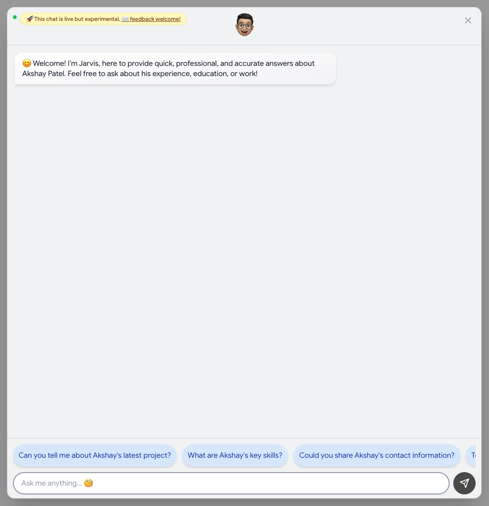

<h1 align="center">J.A.R.V.I.S.</h1>
<p align="center"><em>A RAG-powered portfolio assistant that lets visitors interactively explore my work through natural conversation.</em></p>
&nbsp;

## 🧠 Mission Briefing

**J.A.R.V.I.S.** is a full-stack application comprising a **FastAPI RAG backend** and a **Next.js chat widget** embedded in my [portfolio](https://akshayrpatel.github.io/). Visitors ask questions about my experience, projects, and skills - the system retrieves relevant documents from a vector database, injects them as context, and generates accurate, conversational answers via LLM.

A centralized **service registry** wires all services at startup - _memory, classification, retrieval, and generation_ - and exposes them through a unified API. The frontend renders responses with **markdown support**, **session-based context**, and a **floating chat modal** with health awareness and animated personality.

&nbsp;

---

# Backend

&nbsp;

## 🤖 The Service Fleet

> **`01`** &nbsp; **RAGService** - Retrieval-Augmented Generation Orchestrator
>
> _Contract:_ User query + session ID in → context-aware, conversational answer + follow-up suggestions out.
>
> The central orchestrator that ties the pipeline together. For each query, it stores the message in memory, classifies it into categories, retrieves relevant documents via vector search, formats everything into a prompt template with conversation history, and sends it to the LLM. The response includes both the answer and generated follow-up questions for guided exploration.

&nbsp;

> **`02`** &nbsp; **CategoryClassifier** - Query Intent Classification
>
> _Contract:_ Raw user query in → category labels out.
>
> Classifies incoming queries into semantic categories (_project, skills, experience, education, contact, etc._), enabling **targeted retrieval** from the knowledge base. Rather than searching the entire vector store, retrieval is scoped to relevant document categories - reducing noise and improving answer relevance.

&nbsp;

> **`03`** &nbsp; **VectorDBService** - Semantic Document Retrieval
>
> _Contract:_ Query + categories in → relevant document chunks out.
>
> Interfaces with **ChromaDB** to perform similarity searches over document embeddings. Documents are pre-embedded and stored as vectors; at query time, the service retrieves the most semantically similar chunks filtered by the classified categories. This is the _retrieval_ half of RAG.

&nbsp;

> **`04`** &nbsp; **MemoryService** - Conversational Context Management
>
> _Contract:_ Session ID → conversation history.
>
> Stores conversation history per session using **LangChain's memory abstractions**, enabling multi-turn context-aware responses. Each session maintains its own message buffer, so follow-up questions like _"tell me more about that"_ resolve correctly against prior context.

&nbsp;

> **`05`** &nbsp; **LLMService** - Multi-Provider Intelligence Layer
>
> _Contract:_ `chat(messages) -> str`
>
> Wraps multiple LLM providers (**Mistral**, **OpenAI/OpenRouter**, **Groq**) behind a unified async interface with automatic **sequential failover**. If the primary provider is unavailable, the request transparently falls through to the next. On complete exhaustion, a graceful fallback message is returned - no raw exceptions ever surface to callers.

&nbsp;

> **`06`** &nbsp; **ServiceRegistry** - Lifecycle & Dependency Injection
>
> A centralized singleton that holds typed references to every service. Manages initialization order and clean shutdown. Services are wired with explicit **constructor injection**, keeping components decoupled and independently testable.

&nbsp;

## ⚡ Execution Flow

```
Visitor (Portfolio)
  │
  │  POST /api/chat
  │  {query: "What projects have you worked on?", session_id: "..."}
  │
  ▼
Router ─────────────────────────────────────────────────────────
  │  Resolve services from ServiceRegistry
  │
  ▼
RAG Pipeline (RAGService)
  │
  ├─ [1] Store query ──▶ MemoryService (session history)
  │
  ├─ [2] Classify query ──▶ CategoryClassifier
  │       → categories: ["project"]
  │
  ├─ [3] Retrieve context ──▶ VectorDBService (ChromaDB)
  │       → relevant document chunks
  │
  ├─ [4] Assemble prompt ──▶ Prompt Template
  │       (query + context + conversation history)
  │
  ├─ [5] Generate answer ──▶ LLMService (with failover)
  │
  ▼
  ◀── JSON: {answer, session_id, followups}
```

The pipeline is **sequential and stateful** - each step depends on the previous. Memory provides conversational continuity, classification scopes the retrieval, and retrieved documents ground the LLM's response in _verifiable facts_ rather than hallucination.

&nbsp;

## 🏗️ Architecture & Design Decisions

1. **Category-aware retrieval over full-store search** - Querying the entire vector store for every question returns noisy, irrelevant chunks that dilute the prompt context. By classifying the query first and scoping retrieval to matching categories, the LLM receives _focused, relevant context_ - improving answer quality and reducing token waste.

2. **Service registry with _constructor injection_** - All services are instantiated through the registry with explicit dependencies. Deterministic initialization order, clean shutdown, and _testability_ through `__init__` parameters rather than global imports. Components don't know where their dependencies come from - **Inversion of Control**.

3. **Session-based memory over stateless queries** - Each conversation maintains its own history buffer keyed by session ID. This enables multi-turn interactions where follow-up questions resolve against prior context. The alternative - treating every query as independent - would make the assistant feel mechanical and context-blind.

4. **Multi-provider failover** - A single LLM provider is a single point of failure. The ordered provider chain (Mistral → OpenAI/OpenRouter → Groq) ensures the assistant remains available even when individual providers go down. Failover is transparent to the caller.

5. **Prompt templates over ad-hoc string assembly** - Context injection uses structured **LangChain prompt templates** rather than manual string concatenation. Templates enforce consistent formatting, make the prompt structure _visible and auditable_, and separate the prompt skeleton from dynamic content.

6. **Follow-up generation** - The LLM generates suggested follow-up questions alongside each answer. This turns the assistant from a _passive Q&A tool_ into a guided exploration experience - visitors discover aspects of my portfolio they wouldn't have thought to ask about.

&nbsp;

## 🛠️ Backend Tech Stack

| Technology                  | Role in **J.A.R.V.I.S.**                                         |
| --------------------------- | ---------------------------------------------------------------- |
| **Python 3.12+**            | Typed runtime with docstring coverage across all modules         |
| **FastAPI**                 | _Async_ HTTP framework with CORS and exception handling          |
| **LangChain**               | Memory management, prompt templates, and chat model abstractions |
| **ChromaDB**                | Vector database for semantic document retrieval via embeddings   |
| **Mistral / OpenAI / Groq** | LLM providers with automatic _sequential failover_               |
| **Pydantic**                | Validation for request/response models                           |
| **Prompt Templates**        | Structured context injection for consistent, auditable prompts   |

&nbsp;

## 🏆 Backend Engineering Wins

1. **Category-scoped vector retrieval** - Rather than dumping the entire knowledge base into the prompt, the classifier narrows retrieval to relevant document categories. The LLM receives _only_ what it needs - focused context that fits within token limits and produces precise answers. This is the difference between a _useful_ RAG system and one that drowns in its own context.

2. **Multi-provider failover with _graceful degradation_** - On provider failure, the next in the chain is tried transparently. On total exhaustion, a polite fallback message is returned rather than an exception. The assistant **never crashes** from a provider outage - the contract holds regardless of infrastructure state.

3. **Session-scoped memory** - Conversation history is maintained per session, enabling natural multi-turn dialogue. The memory buffer provides the LLM with conversational context without requiring the client to resend the entire history on every request.

4. **Guided exploration via follow-ups** - Each response includes LLM-generated follow-up questions, turning passive Q&A into active portfolio discovery. Visitors are guided through my work without needing to know what to ask.

&nbsp;

---

# Frontend

&nbsp;

<p align="center">
  
</p>

## 🧠 Overview

The **J.A.R.V.I.S. frontend** is a floating chat widget embedded in my [Next.js portfolio site](https://akshayrpatel.github.io/). It presents as an animated **memoji button** in the bottom-right corner that expands into a full chat modal with markdown rendering, session-based context, and health-aware state management.

The design is intentionally _contained_ - a self-sufficient chat experience that overlays the portfolio without disrupting the main page flow.

&nbsp;

## ✨ Features

- **Floating chat widget** - animated memoji button with a _"Chat with me!"_ glass-morphism tooltip, always visible regardless of scroll position
- **Full chat modal** - header with live status indicator, scrolling message window, and input bar with character limit
- **Markdown rendering** - assistant responses render with full markdown support via **react-markdown** with GitHub Flavored Markdown and line break plugins
- **Session-based context** - conversation history maintained across messages within a session for multi-turn dialogue
- **Health-aware UI** - pings the backend on mount with _retry every 10 seconds_ if offline; status reflected via animated green/red indicator with tooltip
- **Suggested follow-ups** - clickable follow-up questions displayed after each response for guided exploration
- **Randomized personality** - welcome messages and memoji expressions randomly selected per session from curated arrays
- **Deep linking** - `?chat=open` query parameter opens the modal directly, enabling links from external sources
- **Responsive layout** - mobile-friendly sizing with Tailwind breakpoints

&nbsp;

## ⚡ Frontend Architecture

The widget follows a **modal-based chat pattern** with centralized state:

```
Portfolio Page
  │
  ├─ Chat closed ──▶ Floating memoji button (bottom-right)
  │                   └─ "Chat with me!" tooltip
  │
  ├─ Chat opened ──▶ Chat Modal
  │                   ├─ Header (memoji + online/offline status)
  │                   ├─ Messages
  │                   │   ├─ User bubbles (blue gradient)
  │                   │   ├─ Bot bubbles (white gradient + markdown)
  │                   │   └─ Typing indicator (animated dots)
  │                   └─ Input bar
  │                       ├─ Sample questions (on first open)
  │                       └─ Text input + send button
  │
  ▼
Backend Communication
  POST /api/chat {query, session_id}
  ◀── JSON: {answer, session_id, followups}
```

A single **`useJarvisState` hook** manages all widget state - modal visibility, messages, session ID, API health, memoji selection, and loading state. Components are purely _presentational_, receiving props from the hook and rendering accordingly.

&nbsp;

## 🛠️ Frontend Tech Stack

| Technology         | Role                                                            |
| ------------------ | --------------------------------------------------------------- |
| **Next.js 15**     | App Router, React Server Components, API proxy route            |
| **React 19**       | UI rendering with hooks-based state management                  |
| **TypeScript 5**   | _Strict typing_ across all components, hooks, and types         |
| **Tailwind CSS 3** | Utility-first styling with responsive breakpoints               |
| **animate.css**    | Entry animations for modal, floating button, and transitions    |
| **react-markdown** | Markdown-to-JSX rendering with _remark-gfm_ and _remark-breaks_ |
| **react-icons**    | Icon library for send button and UI elements                    |

&nbsp;

## 🏆 Frontend Engineering Wins

1. **Health check with _automatic retry_** - On mount, the widget pings the backend and reflects connectivity immediately. If the API is down, it retries every 10 seconds until it comes back online - the memoji switches from _sad_ to _happy_, the status dot turns green, and the input enables. No manual refresh needed, no silent failures.

2. **Optimistic message insertion** - When the user sends a message, both the user message and a _thinking_ placeholder are appended synchronously before the network request fires. The conversation feels instant even on slow connections - no blank gap while waiting for the response.

3. **Session-scoped randomized personality** - Memoji expressions, welcome messages, and unavailable messages are drawn from curated arrays using random selection _once_ at component mount. The personality is consistent within a visit but varied across visits - making the widget feel less mechanical without causing jarring re-rolls on re-render.

4. **Custom markdown styling per sender** - The markdown renderer applies different Tailwind classes based on message sender. Bot messages get blue-toned headers and styled code blocks; user messages get white text on gradient backgrounds. One renderer, _two visual languages_ - clean separation without duplicating components.

5. **Deep-linkable chat modal** - The `?chat=open` query parameter opens the modal after a 1.5-second delay, enabling direct links to the chat from resumes, cover letters, or external pages. A small detail that turns the widget into a _reachable destination_ rather than just a floating button.

6. **Discriminated union types for _future extensibility_** - Message content types use a TypeScript discriminated union keyed by component type (_project, contact, skills, experience_). Currently only text is rendered, but the type system is ready for rich structured cards without any refactoring - the shape is defined, only the renderers need to be added.

&nbsp;

## 🏗️ Frontend Design Decisions

1. **Custom hook over scattered state** - All widget state lives in `useJarvisState` rather than spread across components. This keeps the component tree purely presentational and makes the state machine _visible in one place_.

2. **Modal over full page** - The chat is a _floating overlay_, not a dedicated route. Visitors can open it from any section of the portfolio without losing their scroll position or navigation context.

3. **Memoji-driven personality** - The floating button and chat header use randomized memoji expressions rather than a static icon. Combined with randomized welcome messages, this gives the assistant a _personality_ that feels alive without being intrusive.

4. **Health check on mount with visual feedback** - Rather than silently failing when the backend is down, the widget communicates its state clearly: sad memoji, red status dot, _"Offline"_ tooltip, and disabled input. Users know exactly what's happening.

5. **Follow-up questions as guided exploration** - Suggested questions are displayed as clickable chips after each response. This turns the experience from _"what should I ask?"_ into _"which of these interests me?"_ - lowering the barrier for visitors to explore deeper.

&nbsp;

---

## 🔮 Future Roadmap

**J.A.R.V.I.S.** is being migrated into the [E.D.I.T.H.](https://github.com/akshayrpatel/edith) agent ecosystem as the **Portfolio Agent** - a RAG-based assistant plugging into E.D.I.T.H.'s service registry, LLM failover chain, and SSE streaming infrastructure. The core RAG pipeline (_classification, retrieval, generation_) will be preserved while gaining access to E.D.I.T.H.'s multi-agent orchestration capabilities.

&nbsp;
